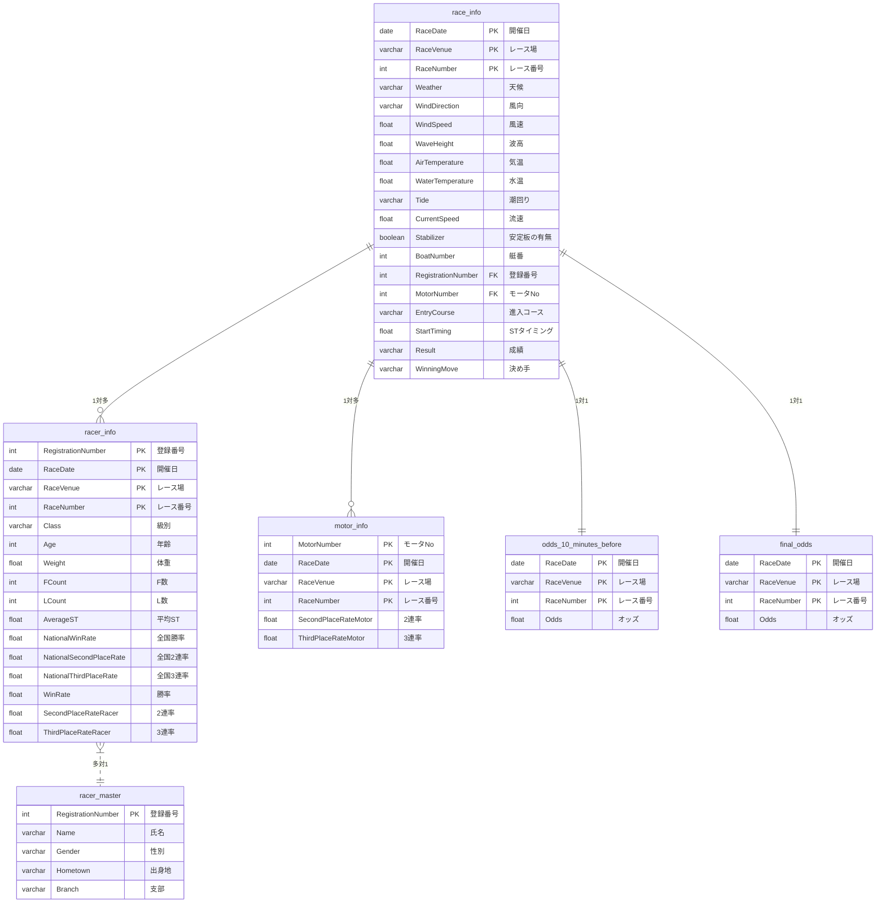

## データモデリング図

## データ構造
### レース情報(race_info)

| **キー情報**         | **項目**                | **データラベリング方針** |
|------------------------|-------------------------|-------------------------|
| **PK**                 | 開催日                 | 日付形式（YYYY-MM-DD）  |
| **PK**                 | レース場               | レース場ごとに一意のID |
| **PK**                 | レース番号             | レース番号そのまま     |
|                        | 天候                    | (例)晴れ: 0, 雨: 1, 曇り: 2, その他: 3 |
|                        | 風向                    | (例)無風: 0, 北: 1, 北東: 2, 東: 3, 南東: 4, 南: 5, 南西: 6, 西: 7, 北西: 8 |
|                        | 風速                    | 風速そのまま（m/s）    |
|                        | 波高                    | 波高そのまま（m）      |
|                        | 気温                    | 気温そのまま（℃）      |
|                        | 水温                    | 水温そのまま（℃）      |
|                        | 潮回り                  | (例)満潮: 0, 下げ潮: 1, 干潮: 2, 上げ潮: 3 |
|                        | 流速                    | 流速そのまま（m/s）    |
|                        | 安定板の有無            | (例)無: 0, 有: 1           |
|                        | 艇番                   | 艇番そのまま           |
| **FK**                 | 登録番号               | 登録番号そのまま       |
| **FK**                 | モータNo               | モータNoそのまま       |
|                        | 進入コース             | 進入コースそのまま     |
|                        | STタイミング           | STタイミングそのまま（秒）|
|                        | 成績                   | 成績そのまま           |
|                        | 決め手                 | (例)逃げ: 0, 差し: 1, まくり: 2, まくり差し: 3, 抜き: 4, 恵まれ: 5 |

### 選手情報(racer_info)
| **キー情報**           | **項目**                | **データラベリング方針** |
|------------------------|-------------------------|-------------------------|
| **PK**                 | 登録番号               | 登録番号そのまま       |
| **PK**                 | 開催日                 | 日付形式（YYYY-MM-DD）  |
| **PK**                 | レース場               | レース場ごとに一意のID |
| **PK**                 | レース番号             | レース番号そのまま     |
|                        | 級別                    | (例)A1: 0, A2: 1, B1: 2, B2: 3 |
|                        | 年齢                    | 年齢そのまま           |
|                        | 体重                    | 体重そのまま（kg）     |
|                        | F数                     | F数そのまま            |
|                        | L数                     | L数そのまま            |
|                        | 平均ST                  | 平均STそのまま（秒）    |
|                        | 全国勝率                | 全国勝率そのまま（%）  |
|                        | 全国2連率               | 全国2連率そのまま（%） |
|                        | 全国3連率               | 全国3連率そのまま（%） |
|                        | 勝率                    | 勝率そのまま（%）      |
|                        | 2連率                   | 2連率そのまま（%）     |
|                        | 3連率                   | 3連率そのまま（%）     |

### 選手マスタ(racer_master)
| **キー情報**         | **項目**                | **データラベリング方針** |
|------------------------|-------------------------|-------------------------|
| **PK**                 | 登録番号               | 登録番号そのまま       |
|                        | 氏名                    | 氏名そのまま           |
|                        | 性別                    | (例)男性: 0, 女性: 1       |
|                        | 出身地                  | 出身地ごとに一意のID   |
|                        | 支部                    | 支部ごとに一意のID     |

### モーター情報(motor_info)
| **キー情報**       | **項目**                | **データラベリング方針** |
|------------------------|-------------------------|-------------------------|
| **PK**                 | モータNo               | モータNoそのまま       |
| **PK**                 | 開催日                 | 日付形式（YYYY-MM-DD）  |
| **PK**                 | レース場               | レース場ごとに一意のID |
| **PK**                 | レース番号             | レース番号そのまま     |
|                        | 2連率                   | 2連率そのまま（%）     |
|                        | 3連率                   | 3連率そのまま（%）     |

<!-- ボート情報は含まれない
### ボート情報
| **ボート情報**         |                         |
|------------------------|-------------------------|
| **PK**                 | **項目**                |
| ボートNo               | 2連率                   |
| 開催日                 | 3連率                   |
| レース場               |                         |
| レース番号             |                         |
-->

### 10分前オッズ(odds_10_minutes_before)
| **キー情報** | **項目**                | **データラベリング方針** |
|--------------|-------------------------|-------------------------|
| **PK**       | 開催日                  | 日付形式（YYYY-MM-DD）  |
| **PK**       | レース場                | レース場ごとに一意のID |
| **PK**       | レース番号              | レース番号そのまま     |
|              | 10分前3連単オッズ       | オッズそのまま         |
|              | 10分前3連複オッズ       | オッズそのまま         |
|              | 10分前2連単オッズ       | オッズそのまま         |
|              | 10分前2連複オッズ       | オッズそのまま         |
|              | 10分前拡連複オッズ      | オッズそのまま         |

### 確定オッズ(final_odds)
| **キー情報** | **項目**                | **データラベリング方針** |
|--------------|-------------------------|-------------------------|
| **PK**       | 開催日                  | 日付形式（YYYY-MM-DD）  |
| **PK**       | レース場                | レース場ごとに一意のID |
| **PK**       | レース番号              | レース番号そのまま     |
|              | 確定3連単オッズ         | オッズそのまま         |
|              | 確定3連複オッズ         | オッズそのまま         |
|              | 確定2連単オッズ         | オッズそのまま         |
|              | 確定2連複オッズ         | オッズそのまま         |
|              | 確定拡連複オッズ        | オッズそのまま         |

